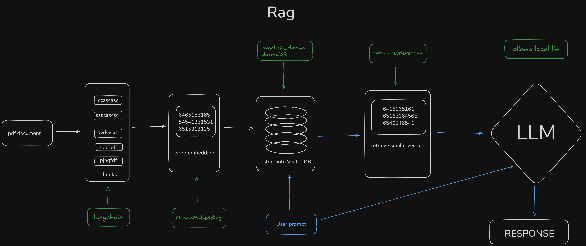
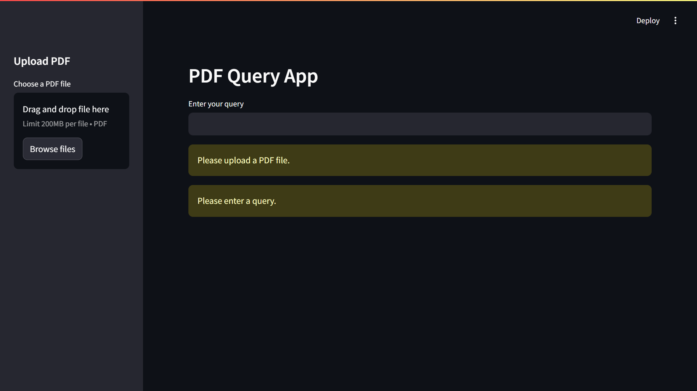

# Retrieval-Augmented Generation PDF Query App

This repository provides a web application built with Streamlit to query PDF documents efficiently. By combining modern AI models for embedding and large language model-based queries, this application processes PDFs to deliver insightful answers to user queries.

## Features

- **PDF Upload and Processing**: Users can upload PDF files to analyze their content.
- **Asynchronous Execution**: Ensures efficient processing of large documents.
- **Text Splitting**: Splits large text into manageable chunks for better embedding and querying.
- **Vector Store Integration**: Uses Chroma for storing document embeddings.
- **AI-Powered Queries**: Integrates the latest LLMs for accurate and contextually rich responses.
- **Chat History**: Keeps track of user queries and corresponding responses.

---

## What is Retrieval-Augmented Generation (RAG)?

Retrieval-Augmented Generation (RAG) is a framework that combines retrieval mechanisms and generative AI models. It works by first retrieving relevant information from a large dataset (e.g., embeddings stored in a vector database like Chroma) and then using a generative model to produce a coherent and contextually relevant response based on the retrieved information.

This approach ensures:

- Access to up-to-date and specific information.
- Reduced reliance on static, pretrained knowledge within the generative model.
- Improved accuracy and relevance in responses.



---

## Installation Guide

Follow these steps to install and run the Retrieval-Augmented Generation PDF Query App:

### Prerequisites
Ensure you have the following installed:

- Python 3.8 or higher
- `pip` for Python package management
- **Ollama Application**: Ensure the Ollama application is installed and running in the background. You can download it from the [Ollama website](https://ollama.ai).
- **Required Models**: Use the following commands to pull the necessary models:
  ```bash
  ollama pull nomic-embed-text:latest
  ollama pull llama3.2:latest
  ```

### Step 1: Clone the Repository
```bash
# Clone the repository
$ git clone https://github.com/yourusername/pdf-query-app.git

# Navigate to the project directory
$ cd pdf-query-app
```

### Step 2: Set Up a Virtual Environment (Optional but Recommended)
```bash
# Create a virtual environment
$ python -m venv venv

# Activate the virtual environment
# On Windows:
$ venv\Scripts\activate
# On Mac/Linux:
$ source venv/bin/activate
```

### Step 3: Install Required Libraries
```bash
# Install dependencies
$ pip install -r requirements.txt
```

### Step 4: Run the Application
```bash
# Start the Streamlit app
$ streamlit run app.py
```

---

## Usage Instructions

1. **Upload a PDF**: Use the sidebar to upload your PDF document.
2. **Enter Your Query**: Input the question you'd like to ask about the document.
3. **View Responses**: The application will process your query and display the result along with a history of previous queries.

---

## Key Components

- **`main(file, query)`**: An asynchronous function to process the PDF and retrieve responses.
- **`RecursiveCharacterTextSplitter`**: Splits the PDF content into chunks for embedding.
- **`OllamaEmbeddings` and `OllamaLLM`**: Utilizes the latest `nomic-embed-text:latest` and `llama3.2:latest` models from Ollama.
- **`Chroma`**: Serves as the vector store for efficient similarity search.
- **Streamlit Interface**: A user-friendly UI to interact with the app.

---

## Troubleshooting

- **Error: Missing Dependencies**: Ensure all required packages are installed using `pip install -r requirements.txt`.
- **Streamlit Not Found**: Run `pip install streamlit` if the module is not found.
- **Model Connection Issues**: Verify that the Ollama application is running and the required models are available using the `ollama pull` command.

---

## Contributing

Contributions are welcome! Please open an issue or submit a pull request for any enhancements or bug fixes.

---

## License

This project is licensed under the MIT License. See the LICENSE file for details.

---

## Screenshot

Below is a conceptual layout of the app:



---

## Contact

For inquiries or support, please reach out at thenan0987@gmail.com

